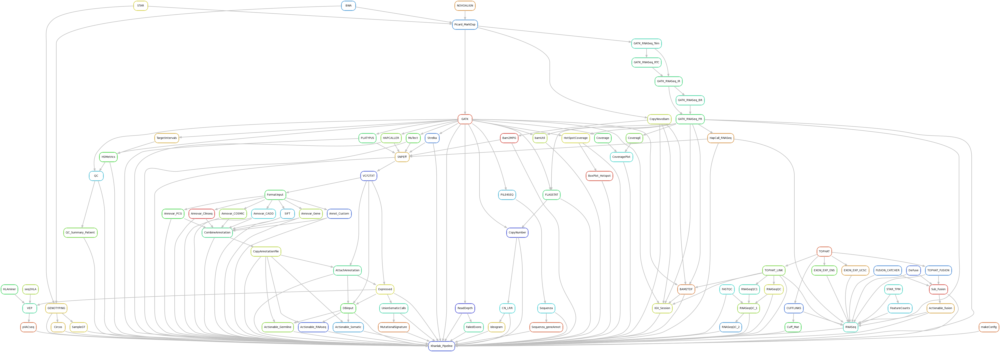

## Introduction
This is the implimentation of [KhanLab](https://ccr.cancer.gov/Genetics-Branch/javed-khan) NGS Pipeline using Snakemake.
## Installation

The easiest way to get this pipeline is to clone the repository.

```
git clone https://github.com/patidarr/ngs_pipeline.git
```
## Requirements
[mutt](http://www.mutt.org/)  
[gnu parallel](http://www.gnu.org/software/parallel/)  
SLURM or PBS for resource management  
Bioinformatics Tools Listed in [config files](config/config_common_biowulf.json)  

## Conventions

- Sample names cannot have "/" or "." in them
- Fastq files end in ".fastq.gz"
- Fastq files are stored in DATA_DIR (Set as Environment Variable) 

### DNASeq:
- QC
- BWA, Novoalign
- Broad Standard Practices on bwa bam
- Haplotype Caller, Platupys, Bam2MPG, MuTect, Strelka
- snpEff, Annovar, SIFT, pph2, Custom Annotation
- Coverage Plot, Circos Plot, Hotspot Coverage Box Plot
- Create input format for oncogenomics database (Patient Level)
- Make Actionable Classification for Germline and Somatic Mutations 
- Copy number based on the simple T/N LogRatio (N cov >=30), Corrected for Total # Reads
- LRR adjusted to center. 

### RNASeq:
- QC
- Tophat, STAR
- Broad Standard Practices on STAR bam
- fusion-catcher, tophat-fusion, deFuse
- Cufflinks (ENS and UCSC)
- In-house Exon Expression (ENS and UCSC)
- Haplotype Caller
- snpEff, Annovar, SIFT, pph2, Custom Annotation
- Actionable Fusion classification

### Patient:
- Genotyping On Patient. 
	1000g sites are evaluated for every library and then compared (all vs all)
	If two libraries come from a patient the match should be pretty good >80%
- Still to develop:
	If the match is below a certain threshold, break the pipeline for patient.

Rulegraph





DAG for example Sample

